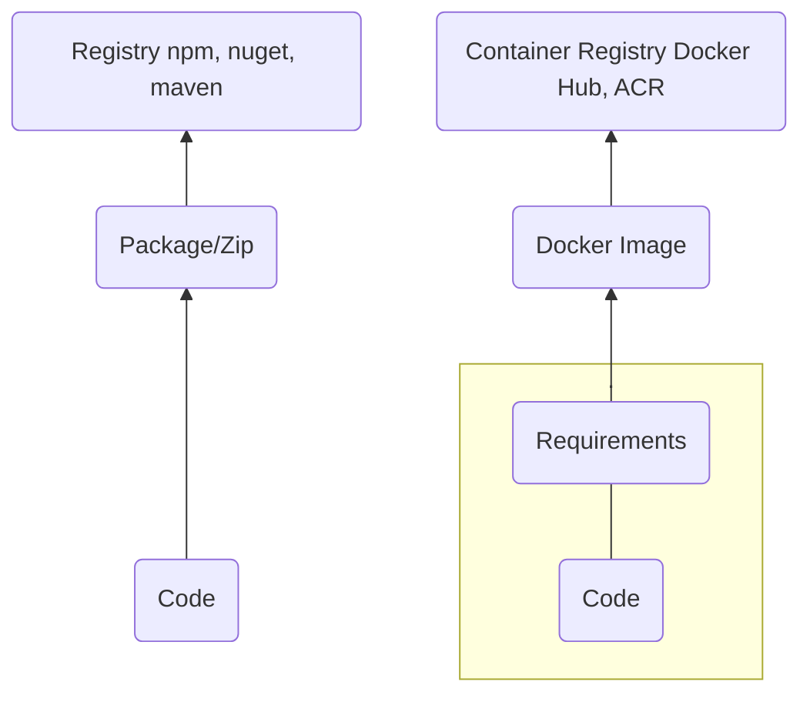

# WTF is Docker?

First someone wanted to share something that they’ve built.The only way was to take someones computer and expose it to the internet

When you got a lot of traffic or needed a beefier computer you had to take everything that you had installed and all the configuration and move that to someone elses computer and setup everything again

Along came Virtual Machines, what if you could copy paste your entire server and put that on multiple servers, on the fly make adjustments to how beefy it is. Give it more CPU, Ram or even GPU.So having a test environment and a production environment is easy. Just copy your production VM to a test server and your good to go. Oh man this is easier than having physical servers.When you have some new code to share with the world just replace your binaries on that VM and you’re up and running

At first you maybe only have one application and it’s specific needs is filled on that virtual machine you copied but hey, a new version of dotnet comes along.You want to use all the new fancy stuff that version provides. Now you have to update your all your virtual machines so that they all have that new version.
A bit tedious but it works, aslong as you don’t forget to update that VM running in production. That has happened to me multiple times.

But what if we have multiple requirements, we have a node application and a python application, what if we only want to have that beefy computer at times when demand is high?In comes containers. Containers are to VMs what VMs where to physical servers. Instead of sharing a VM with multiple applications – a container IS the application including it’s requirements.Your declaration of requirements lives alongside your code, so when your application needs to upgrade to node@22 or dotnet@9 you just update YOUR code. No upgrading VMs or making sure that you remembered to upgrade the production server.Everything lives inside that container.

## Creating deployables

### Before containers

Historically you would take your code, run it through a build pipeline, package it in the way your registry expects it and push it to a registry. In most cases this can contain executables or just code that some other application can use.

When you are to deploy this you better hope that your deploy target has all the requirements that you expect.
Correct runtime version, libs, etc.

### With containers

Instead of bundeling only your code you create a _manifest_, `Dockerfile`, that contains not only your requirements, OS, libs, runtimes etc, but also your code and _HOW_ to build your code. There's a plethora of prebuilt containers that you can start from. You can find public ones on [Docker Hub](https://hub.docker.com/)

Finally in your Dockerfile you tell Docker what command to run when the container is started.
